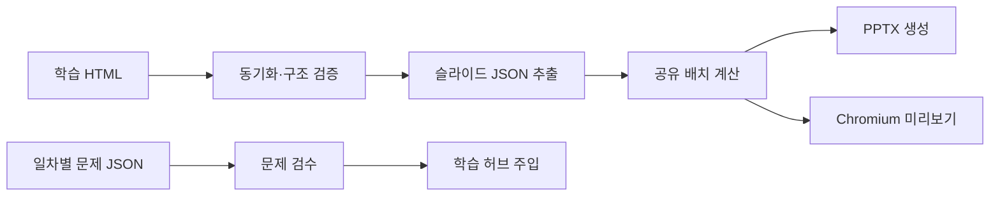

# ora-ppt-gen — HTML 학습 문서 → PPTX

**Experimental** · 문서 자동화 / 데이터 변환 / 검증 도구

Oracle 학습 HTML을 슬라이드 스펙 JSON으로 추출하고 PPTX로 변환하는 파이프라인입니다.
문서·학습 허브·발표 자료를 따로 갱신하는 반복 작업을 줄이기 위해 동기화와 검증을 연결했습니다.

## 문제와 내가 한 일

같은 학습 내용을 HTML, 문제, 발표 자료로 관리하면 원문 변경이 일부 결과물에만 반영될 수 있습니다.
HTML을 기준 자료로 두고 원문 추출과 슬라이드 렌더링을 분리했습니다.
동기화 검증·문제 주입·미리보기 도구를 연결해 변환 과정에서 확인할 지점을 만들었습니다.

AI-assisted development로 코드와 학습 자료 작성을 보조합니다.
요구사항·문서 구조·코드 리뷰·출처 대조·산출물 검수는 개발자의 책임으로 둡니다.
원문을 추출하는 변환 과정이 학습 내용 자체의 사실성을 보증하지는 않습니다.

## 현재 기능

| 기능 | 구현 근거 |
| --- | --- |
| HTML 동기화·학습 허브 재주입·구조 검증 | [sync_and_verify.py](sync_and_verify.py) |
| HTML → 슬라이드 JSON 추출 | [extract_slides.py](extract_slides.py) |
| 페이지 분할·배치·PPTX 생성 | [layout.js](layout.js), [build_ppt.js](build_ppt.js) |
| 동일 좌표의 HTML 미리보기·PNG 촬영 | [preview.js](preview.js) |
| 일차별 문제 검수·주입·자료 생성 | [check_quiz.py](check_quiz.py), [inject_quiz.py](inject_quiz.py), [make_day.py](make_day.py) |
| 발표 노트·자료실 생성 | [notes_export.py](notes_export.py), [build_library.py](build_library.py) |

## Architecture · 기술 선택



- **Python / BeautifulSoup / lxml**: HTML 구조를 읽고 동기화·추출·검증을 수행합니다.
- **JSON 중간 형식**: 원문 추출과 발표 자료 렌더링을 분리합니다.
- **Node.js / PptxGenJS**: 슬라이드 요소를 PPTX로 생성합니다.
- **공유 layout.js / Playwright**: 렌더러와 미리보기의 배치 계산을 공유합니다. 미리보기는 PowerPoint 렌더링과 동일하지 않습니다.

## 실행

Python 3, Node.js/npm이 필요합니다. 저장소 루트에서 실행합니다.

```bash
python3 -m venv .venv
source .venv/bin/activate
python -m pip install -r requirements.txt
npm ci
python make.py assets/sql_tuning.html
```

`assets/`와 `days/`는 저장소에 포함되어 있습니다. 생성 결과는 `out/`에 기록합니다.
`make.py`는 기본적으로 HTML 검증 실패 시 중단합니다. 실패한 자료는 먼저 원문 오류를 확인해야 합니다.

`--preview`는 추가 Chromium 설치가 필요하고 현재 `preview.js`의 실행 경로가 로컬 환경에 고정되어 있습니다.
따라서 새 환경에서 미리보기까지 바로 실행된다고 보장하지 않습니다.
실제 PPTX의 최종 화면은 PowerPoint 또는 LibreOffice에서 별도로 검수해야 합니다.

## 테스트·검증과 현재 한계

- 구조 검증, 문제 JSON 검수, 저작 린트, Chromium 미리보기 도구가 있습니다.
- 별도의 자동 테스트 스위트와 GitHub Actions CI는 현재 확인되지 않습니다. 검증 스크립트의 존재를 전체 파이프라인 테스트 통과로 표현하지 않습니다.
- 입력 문서의 구조·SVG 스타일·폰트에 따라 결과가 달라집니다. 원문 구조 오류가 있으면 변환이 중단될 수 있습니다.
- 2026-09-30 공개 `sql_tuning.html`의 JSON 추출과 PPTX 생성은 실행 확인했습니다. 생성기는 한 슬라이드의 넘침 가능성을 경고했으며, 실제 PowerPoint 화면의 최종 검수는 남아 있습니다.
- 같은 날 `npm audit`는 기존 `image-size`와 `sharp` 의존성에 high 등급 경고를 보고했습니다. 의존성 갱신과 변환 회귀 검증은 별도 과제입니다.
- `files/`의 PPTX는 자료실 배포용으로 추적하는 생성물입니다. 소스 자료는 `assets/`와 `days/`에서 확인할 수 있습니다.
- 범용 HTML 변환기나 자동 사실 검증 시스템이 아닙니다.

## 현재 상태

**Experimental** — 학습 자료를 대상으로 변환·검증 도구와 생성 결과를 공개합니다.
공개 서비스의 운영 안정성이나 처리 성능 수치는 별도로 주장하지 않습니다.

[시스템 개요](docs/SYSTEM_OVERVIEW.md) · [저작 규약](AUTHORING.md) · [학습 루틴](docs/STUDY_ROUTINE.md) · [포트폴리오](https://gwangwon.dev)
